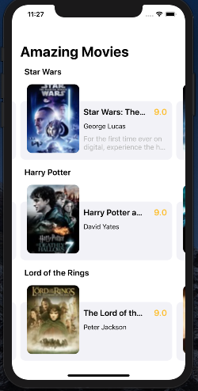

# Networking.Arriaga.Demo

This demo application fetches data from the iTunes API and organizes it inside of the brand new Compositional Layout for UICollectionViewController that was release in iOS 13. As a bonus, I've decided to fead the data into the controller using the (also brand new) diffable data source introduced at WWDC 19.

## Techniques implemented:
* Compositional Layout
* UICollectionViewController
* DiffableData Source
* Singleton design pattern for Service networking layer
* URLSession class API for downloading data from indicated URLs
* Support for dark mode

## ScreenShots

### Prerequisites

iOS 13.2+
Swift 5+
Xcode 11+

## Versioning

1.0

## Authors

* **Arturo Arriaga** - *Initial work* - [ArturoArriaga](https://github.com/ArturoArriaga)

## License

This project is licensed under the MIT License - see the [LICENSE.md](LICENSE.md) file for details

## Acknowledgments

* Matt Neuburg - Programming IOS 13: Dive Deep Into Views, View Controllers, and Frameworks
* Inspiration/Deisgn by - Yao Yunquiang - China

* WWDC 19 - Advances in CollectionView Layout -  https://developer.apple.com/videos/play/wwdc2019/215/
* WWDC 19 - Advances in UI Data Sources - https://developer.apple.com/videos/play/wwdc2019/220/

